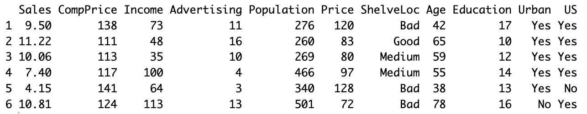
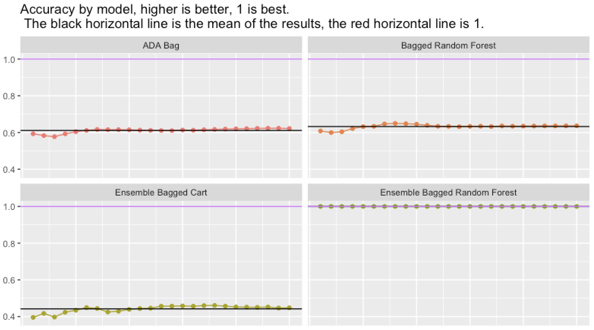
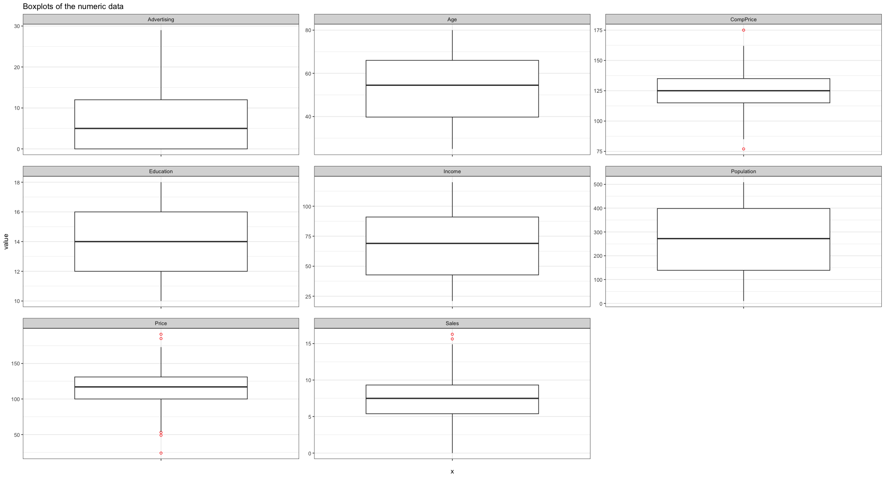
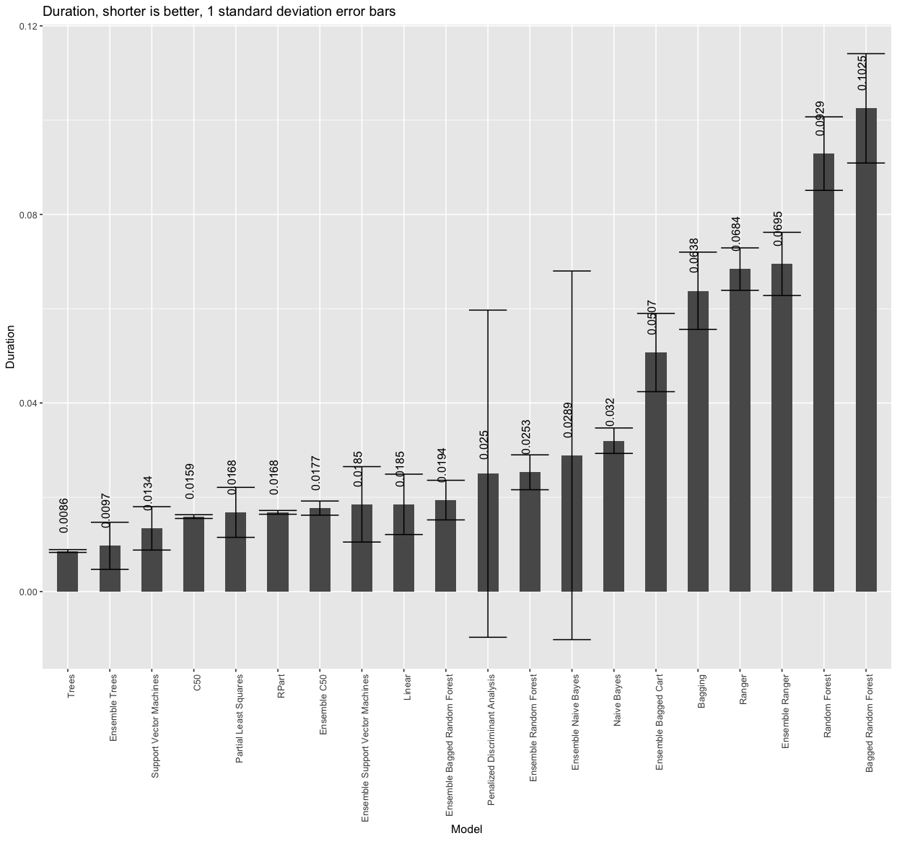
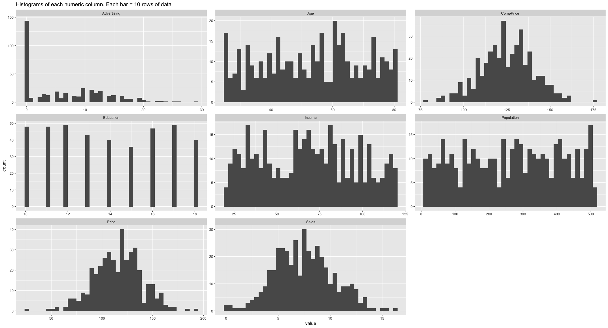
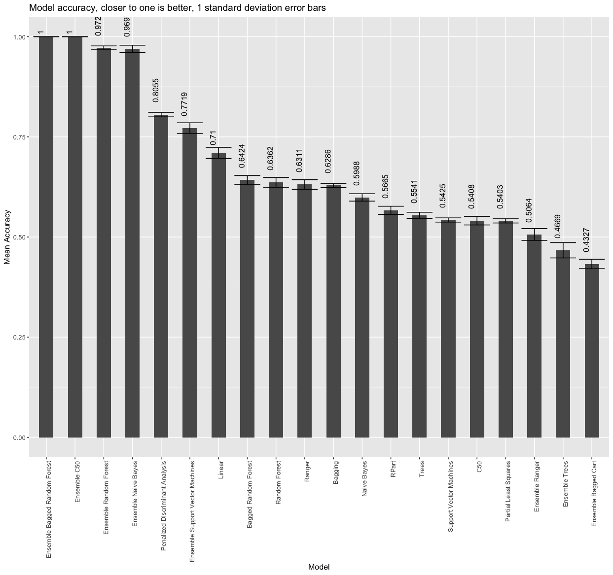
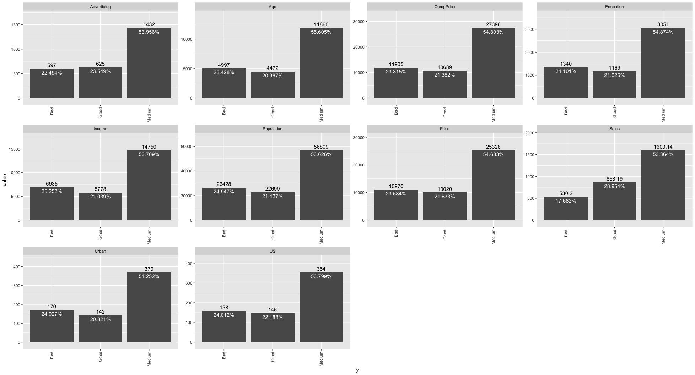
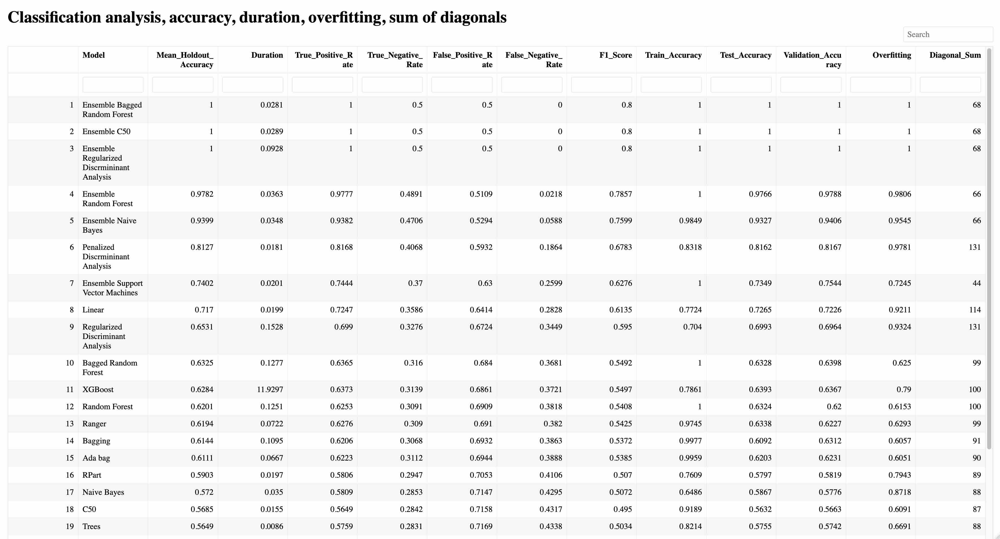
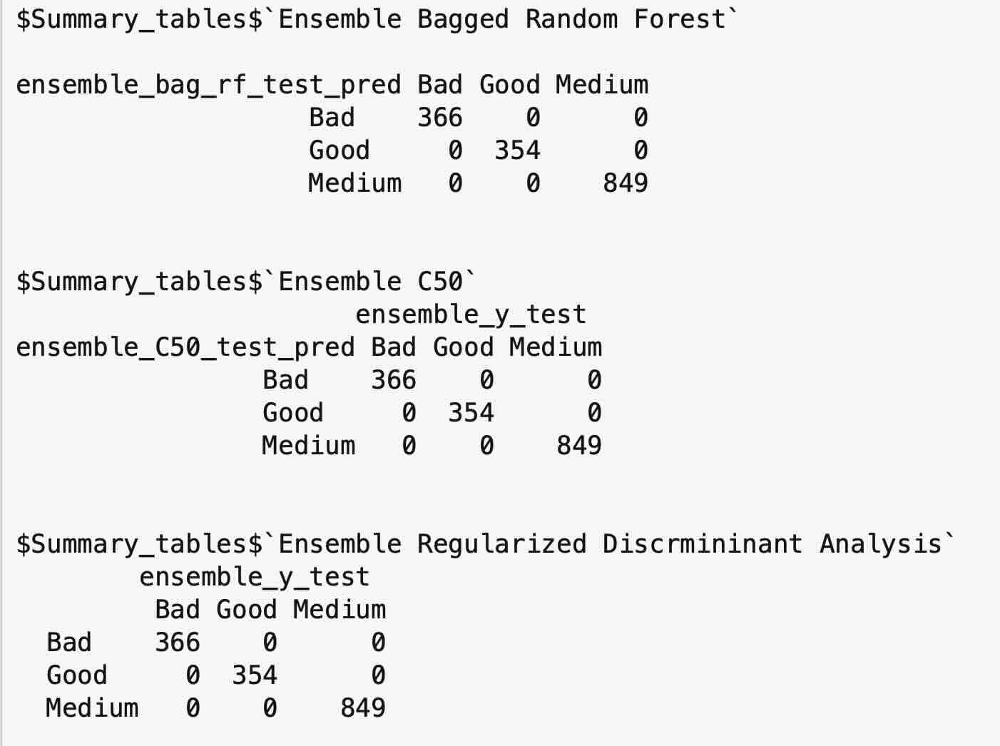

---

---
title: "ClassificationEnsembles-vignette"
output: rmarkdown::html_vignette
vignette: >
  %\VignetteIndexEntry{ClassificationEnsembles-vignette}
  %\VignetteEngine{knitr::rmarkdown}
  %\VignetteEncoding{UTF-8}
---

Welcome to ClassificationEnsembles! The goal of ClassificationEnsembles is to automatically conduct a thorough analysis of classification data. The user only needs to provide the data, answer a few questions, and the package does all the rest for you!.

ClassificationEnsembles automatically fits 12 individual models, to the training data, and also makes predictions and checks accuracy on the test and validation data sets.It also builds 8 ensembles of models, fits each ensembles model to the training ensemble data, makes predictions and checks accuracy on the test and validation data. The package automatically returns 26 plots, and five summary tables. The summary report shows the most accurate results at the top of the report.

The function will automatically work with any number of levels. In this example the data has three levels. Note that the function will automatically figure out the three levels, and build the models from there.

# Installation

You can install the development version of ClassificationEnsembles like so:

```         
devtools::install_github("InfiniteCuriosity/ClassificationEnsembles")
```

# Example

```         
library(ClassificationEnsembles)
Classification(data = ISLR::Carseats,
               colnum = 7,
               remove_VIF_above = 5.00,
               numresamples = 25,
               predict_on_new_data = "N",
               how_to_handle_strings = 1,
               save_all_trained_models = "N",
               save_all_plots = "N",
               scale_all_numeric_predictors_in_data = "N",
               use_parallel = "Y",
               train_amount = 0.60,
               test_amount = 0.20,
               validation_amount = 0.20)
```

ClassificationEnsembles will automatically build 25 models to predict the location of carseats (Bad, Medium, Good). The data is available as part of the ISLR package.

This is the head of the data set. We will be modeling the ShelveLoc column:

{width="700"}

**The 12 individual classification models are:**

1 Bagging

2 Bagged Random Forest

3 C50

4 Linear

5 Naive Bayes

6 Partial Least Squares

7 Penalized Discriminant Analysis

8 Random Forest

9 Ranger

10 RPart

11 Support Vector Machines

12 Trees

<br>

**The 8 ensembles are:**

1 Ensemble Bagged Cart

2 Ensemble Bagged Random Forest

3 Ensemble C50

4 Ensemble Naive Bayes

5 Ensemble Random Forest

6 Ensemble Ranger

7 Ensemble Support Vector Machines

8 Ensemble Trees

<br>

**A few of the 26 plots automatically created (these are close-up views)**

Accuracy by model and resample

{width="700"}

<br>

Boxplots of the numeric data

{width="700"}

<br>

Duration barchart

{width="700"}

<br>

Histograms of the numeric columns

{width="700"}

<br>



Model accuracy barchart closeup

<br>

Target vs each feature

{width="700"}

<br>

**Summary report example:**



The summary report provides the following for each classification model:

Model name

Holdout accuracy

Duration

True Positive Rate

True Negative Rate

False Positive Rate

False Negative Rate

F1 Score

Train Accuracy

Test Accuracy

Validation Accuracy

Overfitting

Diagonal Sum

**Summary tables for all models (top three shown in the graphic)**




The package also provides summary tables for all models. Here are the summary tables for the models with the highest accuracy:

# Grand summary

The ClassificationEnsembles package was able to build 25 classification models from the Carseats data. Three of the ensembles had 100% accuracy 25 times in a row on the holdout data.

The package also automatically provided 11 plots, three tables, a summary report, and summary tables all the models.
