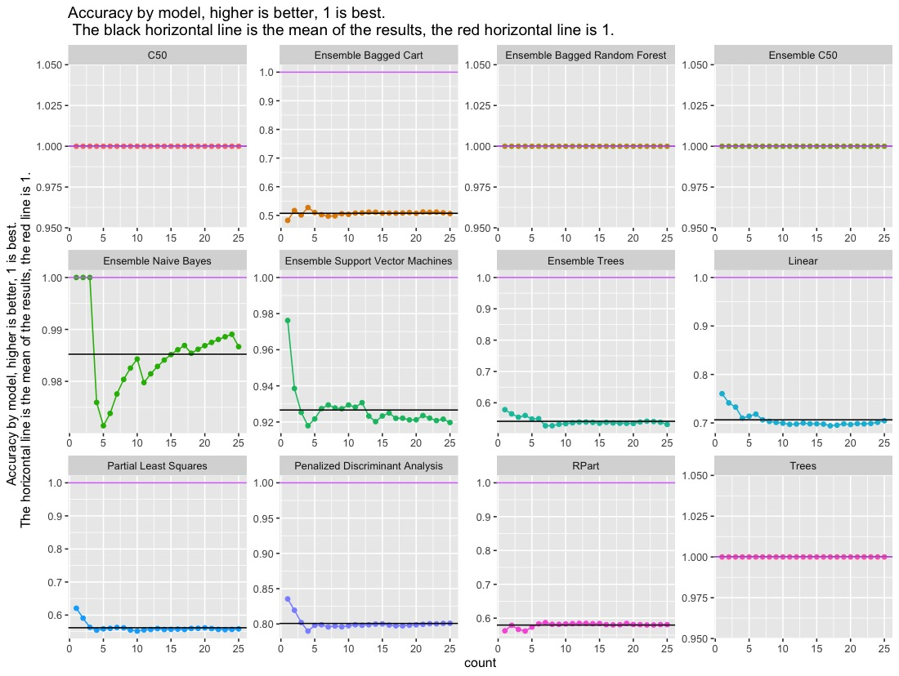
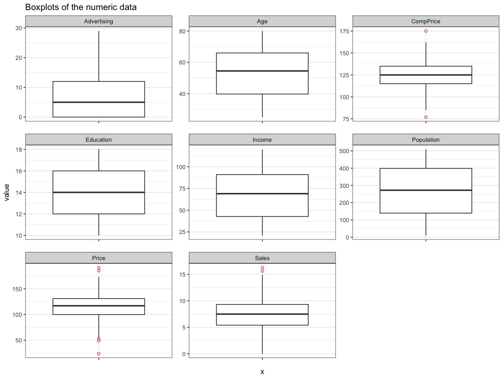
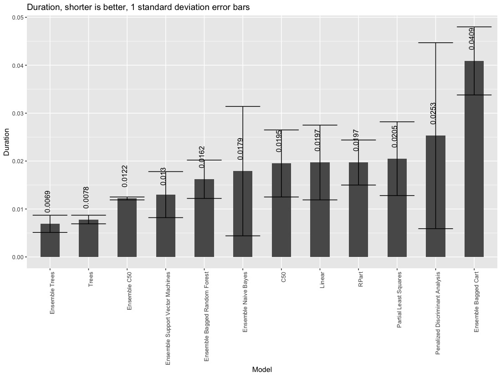
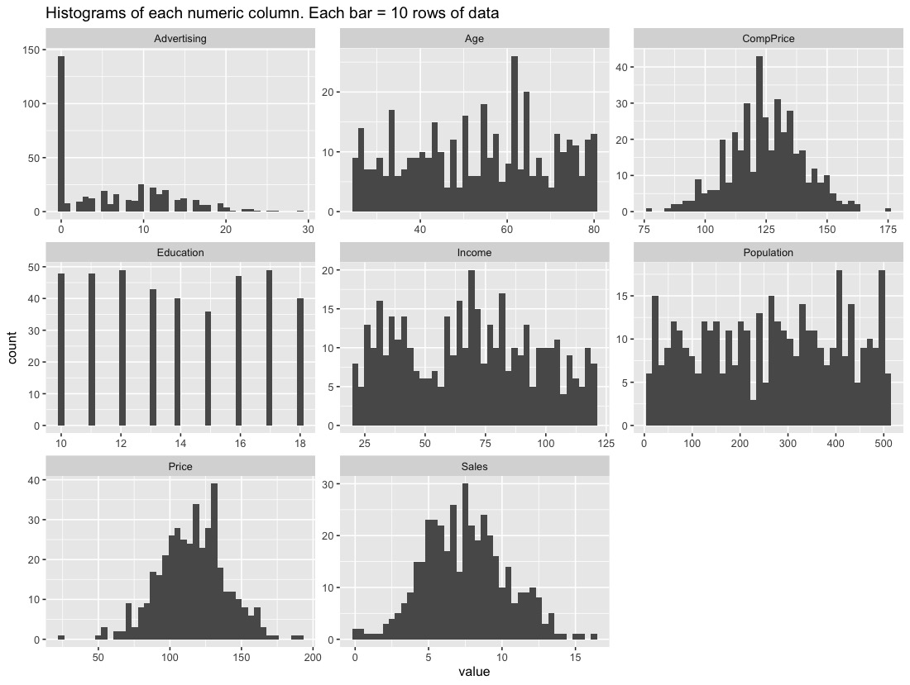
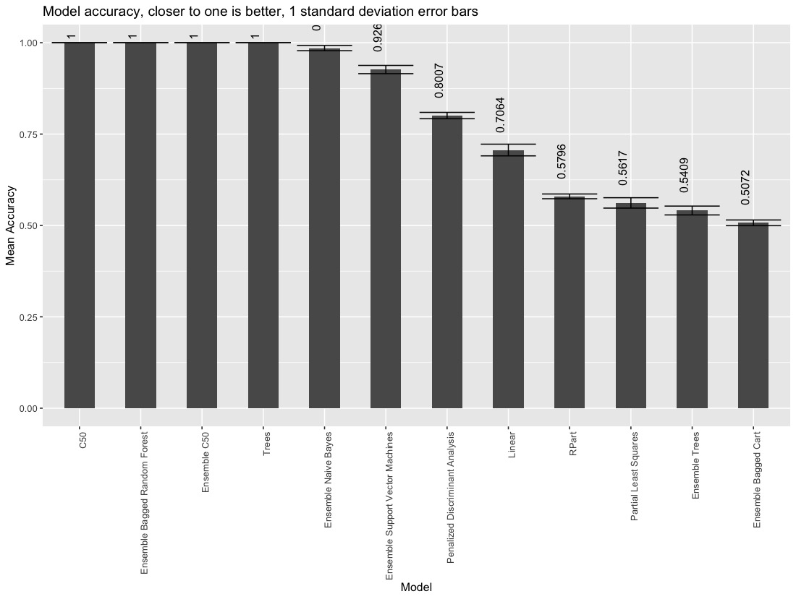
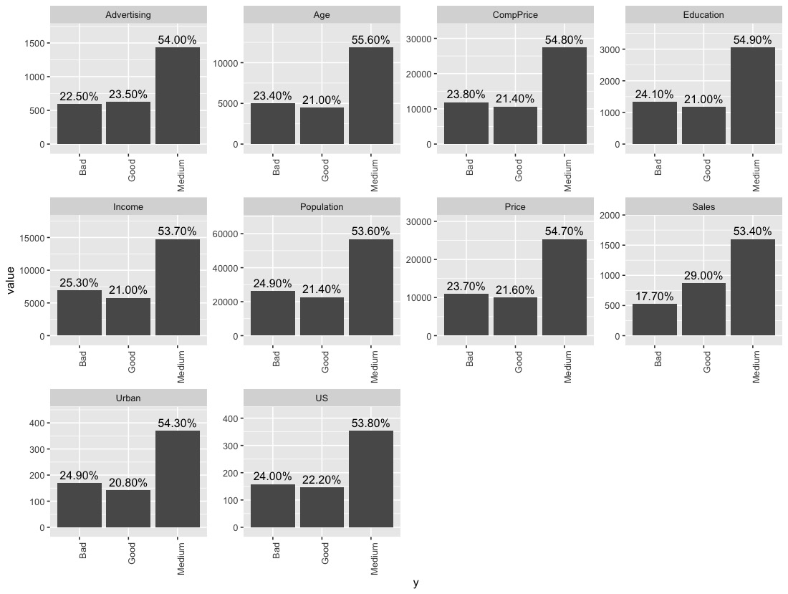
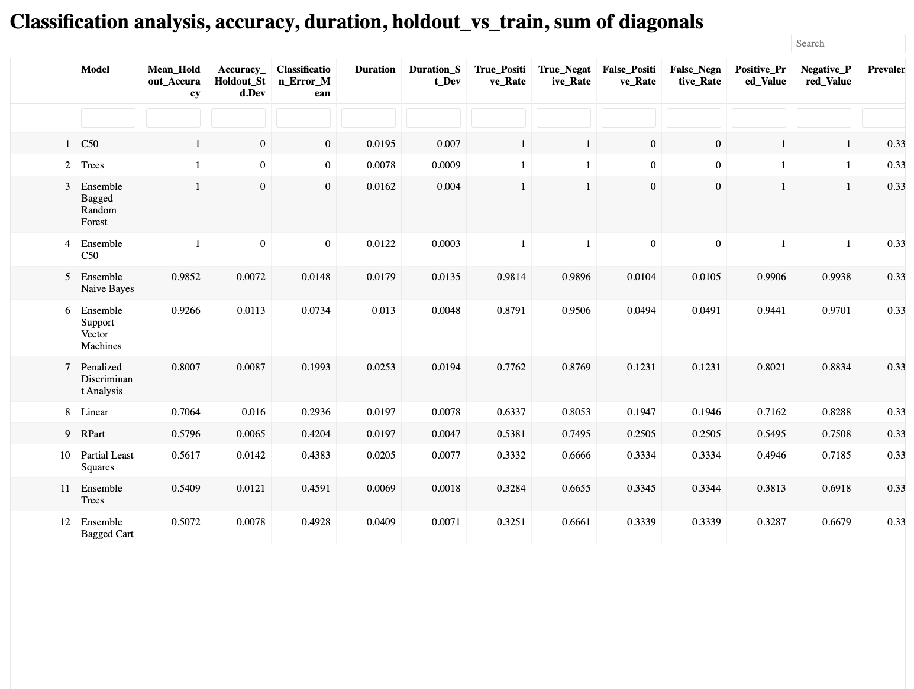

------------------------------------------------------------------------

---
title: "ClassificationEnsembles-vignette"
output: rmarkdown::html_vignette
vignette: >
  %\VignetteIndexEntry{ClassificationEnsembles-vignette}
  %\VignetteEngine{knitr::rmarkdown}
  %\VignetteEncoding{UTF-8}
---

Welcome to ClassificationEnsembles! The goal of ClassificationEnsembles is to automatically conduct a thorough analysis of classification data. The user only needs to provide the data, answer a few questions, and the package does all the rest for you!.

ClassificationEnsembles automatically fits six individual models, to the training data, and also makes predictions and checks accuracy on the test and validation data sets.It also builds six ensembles of models, fits each ensembles model to the training ensemble data, makes predictions and checks accuracy on the test and validation data. The package automatically returns 26 plots, and five summary tables. The summary report shows the most accurate results at the top of the report.

The function will automatically work with any number of levels. In this example the data has three levels. Note that the function will automatically figure out the three levels, and build the models from there.

# Installation

You can install the development version of ClassificationEnsembles like so:

```         
devtools::install_github("InfiniteCuriosity/ClassificationEnsembles")
```

# Example

```         
library(ClassificationEnsembles)
Classification(data = ISLR::Carseats,
               colnum = 7,
               numresamples = 25,
               predict_on_new_data = "N",
               set_seed = "N",
               remove_VIF_above = 5.00,
               scale_all_numeric_predictors_in_data = "N",
               how_to_handle_strings = 1,
               save_all_trained_models = "N",
               save_all_plots = "N",
               use_parallel = "Y",
               train_amount = 0.60,
               test_amount = 0.20,
               validation_amount = 0.20)
```

**Note: ALL 14 fields in the function call must be filled in (data, colnum, numresamples, etc.). An error will be returned if any of the 14 fields are not filled in.** For example, this returns an error:

```         
library(ClassificationEnsembles)
Classification(data = ISLR::Carseats,
               colnum = 7,
               numresamples = 25,
               use_parallel = "Y",
               train_amount = 0.60,
               test_amount = 0.20,
               validation_amount = 0.20) # Returns an error
# Error in if (set_seed == "Y") { : the condition has length > 1
```

## Working example:

ClassificationEnsembles will automatically build 20 models to predict the location of carseats (Bad, Medium, Good). The data is available as part of the ISLR package.

This is the head of the data set. We will be modeling the ShelveLoc column.

**The six individual classification models are:**

1 C50

2 Linear

3 Partial Least Squares

4 Penalized Discriminant Analysis

5 RPart

6 Trees

<br>

**The 6 ensembles are:**

1 Ensemble Bagged Cart

2 Ensemble Bagged Random Forest

3 Ensemble C50

4 Ensemble Naive Bayes

5 Ensemble Support Vector Machines

6 Ensemble Trees

<br>

**A few of the 26 plots automatically created (these are close-up views)**

Automatic plot of Accuracy by model and resample. Accuracy is the y-axis, each resample is the x-axis. The best possible accuracy is 1.00:



<br>

Automatic Boxplots of the numeric data:



<br>

Automatic Duration barchart:



<br>

Automatic Histograms of the numeric columns:



<br>

Automatic barchart of mean model accuracy, in descending order.

Model accuracy barchart closeup



<br>

Automatic Target vs each feature



<br>

**Summary report example:**



The summary report provides the following for each classification model (these are each column in the report):

Model name

Holdout accuracy

Duration

True Positive Rate

True Negative Rate

False Positive Rate

False Negative Rate

F1 Score

Train Accuracy

Test Accuracy

Validation Accuracy

Overfitting

Diagonal Sum

**Summary tables for all models (top three shown in the graphic)**


# Grand summary

The ClassificationEnsembles package was able to build 12 classification models from the Carseats data. Two of the ensembles had 100% accuracy 25 times in a row on the holdout data, and so did two of the individual models.

The package also automatically provided 11 plots, three tables, a summary report, and summary tables all the models.
